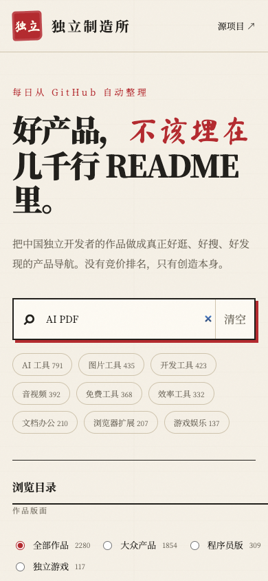

# 独立制造所 · 中国独立开发者产品导航

> 一个把「中国独立开发者及其产品」整理成**可搜索、可筛选、每天自动更新**的导航网站，像 hao123 一样打开就能用。

🔗 线上地址：**https://kolbyzhu5.github.io/indie-maker-directory/**

---

## 系统介绍

独立开发者的产品散落在 GitHub、官网、应用商店各处，而原数据源 [`1c7/chinese-independent-developer`](https://github.com/1c7/chinese-independent-developer) 是一份持续维护的 Markdown 清单——内容很棒，但**长列表不便浏览和搜索**。

「独立制造所」把这份清单做成了一个现代化导航站：

- 自动解析上游三个版面（主版 / 程序员版 / 游戏版）的全部项目
- 每天定时同步一次，数据自动保持最新
- 纯静态网站，部署在 GitHub Pages，**免费、快速、零维护成本**

当前收录 **2,200+ 个独立开发者产品**，涵盖 AI 工具、音视频、文档办公、效率工具、开发工具、浏览器插件、独立游戏等类别。

## 用途

| 场景 | 说明 |
|---|---|
| 🧭 发现好产品 | 按分类浏览，找到国内独立开发者做的小而美的工具 |
| 💡 找创业灵感 | 看别人在做什么、什么产品已上线，寻找产品方向和商业化思路 |
| 📖 学习参考 | 从产品介绍、技术栈和形态中了解独立开发者的玩法 |
| 🔍 精准搜索 | 全文搜索产品名、介绍、开发者、城市，秒出结果 |
| 🕗 状态识别 | 开发中 / 已上线 / 已关闭一目了然，避免浪费时间在停更产品上 |

## 功能特性

- ✅ **全文搜索**：产品名称、一句话介绍、开发者、城市均可搜索
- ✅ **三版切换**：普通版 / 程序员版 / 游戏版一键切换
- ✅ **多维度筛选**：按状态（开发中 / 已上线 / 已关闭）、热门分类筛选
- ✅ **排序**：最近收录、名称、开发者
- ✅ **渐进加载**：数千条数据分批渲染，不卡顿
- ✅ **响应式**：桌面端、手机端自适应
- ✅ **URL 可分享**：搜索和筛选条件写入地址栏，复制链接即分享当前视图
- ✅ **每日自动更新**：GitHub Actions 每天同步上游数据并重新部署
- ✅ **数据保护**：上游格式异常时不会用空数据覆盖现有内容

## 系统截图

**桌面端**


**移动端**



## 快速开始

直接访问线上地址即可，无需安装：

```
https://kolbyzhu5.github.io/indie-maker-directory/
```

### 本地运行

```bash
git clone https://github.com/kolbyzhu5/indie-maker-directory.git
cd indie-maker-directory

# 1. 重新抓取并解析上游数据（生成 data/projects.json）
npm run sync

# 2. 本地预览
python3 -m http.server 4173
# 浏览器打开 http://127.0.0.1:4173
```

### 运行测试

```bash
npm test
```

## 技术架构

```
┌─────────────────────────────────────────────┐
│  上游数据源                                 │
│  1c7/chinese-independent-developer (3 版面) │
└──────────────────┬──────────────────────────┘
                   │ 每日 22:20 (UTC+8 06:20)
                   ▼
┌─────────────────────────────────────────────┐
│  GitHub Actions (update-and-deploy.yml)     │
│  ① npm test     ② npm run sync             │
│  ③ 提交数据      ④ 部署到 GitHub Pages      │
└──────────────────┬──────────────────────────┘
                   ▼
┌─────────────────────────────────────────────┐
│  静态站点 (原生 HTML/CSS/JS)                │
│  index.html + styles.css + app.js           │
│  data/projects.json (结构化项目数据)        │
└─────────────────────────────────────────────┘
```

| 模块 | 技术 |
|---|---|
| 前端 | 原生 HTML / CSS / JavaScript，零依赖 |
| 数据脚本 | Node.js（无第三方依赖），Markdown → JSON |
| 测试 | Node.js 内置 test runner |
| CI/CD | GitHub Actions + GitHub Pages |

## 数据来源

- 上游清单：[`1c7/chinese-independent-developer`](https://github.com/1c7/chinese-independent-developer)（感谢维护者的持续更新）
- 本项目每天自动同步上游，不手动干预
- 收录标准、项目状态标记（🕗 开发中 / ✅ 已上线 / ❌ 已关闭）遵循上游规则

## 贡献

- 想收录自己的产品？请先向上游仓库 [`1c7/chinese-independent-developer`](https://github.com/1c7/chinese-independent-developer) 提交，本站在次日自动同步
- 想改进本站？欢迎提交 Issue 或 Pull Request（搜索体验、视觉设计、新筛选维度等）

## License

本项目代码部分为 MIT License。收录的产品信息版权归各自作者所有，数据以[上游仓库](https://github.com/1c7/chinese-independent-developer)为准。
