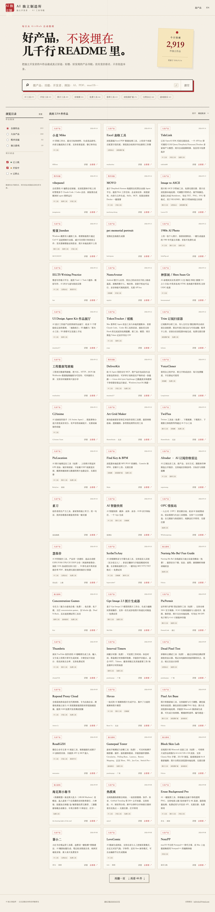

# 我把 2900 个独立开发者的产品，做成了一个导航站

我的浏览器收藏夹里，躺着 400 多个「以后再看」的工具链接。上个月我翻了翻，能打开的不到一半，真正还在用的，一个都没有。

你是不是也这样：刷到一篇「10 个宝藏 AI 工具」，转发收藏，然后就没有然后了。等真要用的时候，翻半天收藏夹，链接早挂了，或者工具早就停止维护了。

更难受的是，那些真正的好东西——独立开发者一个人闷头做出来的小众工具——反而被埋在几千行 README 的最底下，搜都搜不到。

所以我做了一件事：把 GitHub 上一份收录了 2900 多个中国独立开发者产品的开源清单，做成了一个能逛、能搜、能筛选的导航站。

名字叫 **AI 独立制造所**，地址是 [indiemaker.cn](https://indiemaker.cn/)。

## 01 · 站里有什么

- 2900 多个产品，按 AI 工具、独立游戏、效率工具、开发工具等 12 个分类排好
- 每个产品有名字、一句话介绍、开发者、收录日期、状态（已上线 / 开发中 / 已停更）
- 支持全文搜索，搜「PDF」「macOS」「AI 视频」都能秒出结果
- 每天自动同步，开源清单更新了，站里第二天跟着更新
- 没有竞价排名，没有广告，就是纯收录

我在里面淘到几个有意思的，说两个。

一个是 **[AIradar](https://indiemaker.cn/p/airadar-ai.html)**，把各家 AI 订阅价格做成一张雷达对比图，谁涨价谁降价一眼看清。另一个叫 **[素刀](https://indiemaker.cn/p/project-7e2184.html)**，一个截图处理的小工具，OCR、贴图、标尺寸都有，装完就不想卸。

这类东西，你在大厂的产品榜单里看不到，因为它们太小了，没人愿意写。

## 02 · 为什么做这个

最直接的原因：那份开源清单很棒，但它是给「开发者」看的，一行行 Markdown，普通用户根本没法用。

我想让这些产品被「用工具的人」看到，而不是只有开发者自己知道。

所以我把清单做成了网页：能搜、能点、能按分类逛，手机上也能用。数据还是每天自动从开源清单同步，我不手动干预，也不收费。

## 03 · 先说清楚，它也有短板

收录的产品来自开源清单，质量参差不齐，有些已经停更了。我能做的只是把它们整理好、让它们能被找到，产品本身好不好用，还得你自己点进去试。

这一点我不糊弄你。

## 04 · 最后

如果你也是那种「收藏了一堆工具但一个没用上」的人，可以来逛逛。不保证每个都是宝藏，但至少，它们不再被埋在几千行 README 里了。

关注我，后台回复关键词「宝藏工具」，我把从 2900 个产品里筛出的 20 个宝藏 AI 工具清单发给你。先去 [indiemaker.cn](https://indiemaker.cn/) 逛逛也行。
